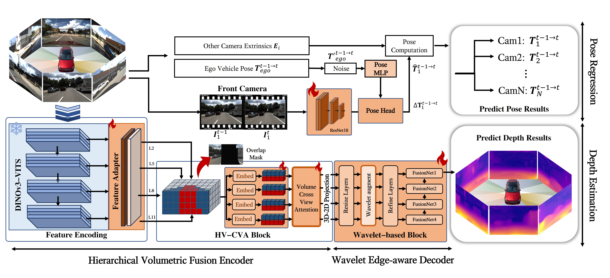

# E2Depth: Efficient Self-supervised surround-view Depth Estimation with Explicit Geometric Enhancement
Sheng Zhang, Juan Li, Chang Liu, Chang Liu, Jie Li and Dongxiao Yang - RA-L 2026

## Introduction
We propose E2Depth, which addresses these limitations
through explicit geometric enhancement at each pipeline
stage. 

  


## Datasets
### DDAD 
* DDAD dataset can be downloaded by running:

```shell
curl -s https://tri-ml-public.s3.amazonaws.com/github/DDAD/datasets/DDAD.tar 
```

* Place the dataset in `<data_dir>/ddad/`
* We manually created mask image for scene of ddad dataset and are provided in `datasets/ddad_mask`

### NuScenes 
* Download NuScenes official dataset
* Place the dataset in `<data_dir>/nuscenes/`
* Scenes with backward and forward contexts are listed in `dataset/nuscenes/`
* Scenes with low visibility are filtered in `dataset/nuscenes/val.txt`

Data should be as follows:
```
├── data_dir
│   ├── ddad
│   │   ├── raw_data
│   │   ├── test_data
│   ├── nuscenes
│   │   ├── samples
│   │   ├── v1.0-mini
│   │   ├── v1.0-test
|   |   ├── v1.0-trainval
```

## Main Results

<table>
  <tr>
    <td>Model</td>
    <td>Abs.Rel.</td>
    <td>Sq.Rel.</td>
    <td>RMSE</td>
    <td>RMSElog</td>
    <td>d<sub>1.25</sub></td>
    <td>d<sub>1.25</sub><sup>2</sup></td>
    <td>d<sub>1.25</sub><sup>3</sup></td>
  </tr>
  <tr>
    <td> DDAD </td>
    <td style="text-align:center">0.179</td>
    <td style="text-align:center">2.575</td>
    <td style="text-align:center">11.785</td>
    <td style="text-align:center">0.296</td>
    <td style="text-align:center">0.757</td>
    <td style="text-align:center">0.904</td>
    <td style="text-align:center">0.956</td>
  </tr>
  
  <tr>
    <td> NuScenes </td>
    <td style="text-align:center">0.250</td>
    <td style="text-align:center">4.523</td>
    <td style="text-align:center">6.719</td>
    <td style="text-align:center">0.314</td>
    <td style="text-align:center">0.783</td>
    <td style="text-align:center">0.902</td>
    <td style="text-align:center">0.944</td>
  </tr>
</table>


The depth estimation results on these dataset as follows:

 

## Quick Start
### Download DINOv3 pretrained weights
Download DINOv3 weights from its [project page](https://github.com/facebookresearch/dinov3), and place them to `networks/dinov3/weights`

### Training
Surround-view fusion depth estimation model can be trained from scratch.
* By default results are saved under `results/<config-name>` and tensorboard file for both training and validation.

```shell
python3 train.py
```

### Eval
Loaded trained weights can be used to metric or inference in the test dataset.

```shell
python eval.py --mode inference --config configs/eval/<config.yaml> --index 0 --cam all
```

## Ablation Results
### Prior Pose Experiments Analysis


## License
This repository is released under the [Apach 2.0](LICENSE) license.